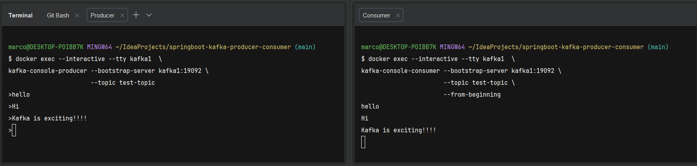
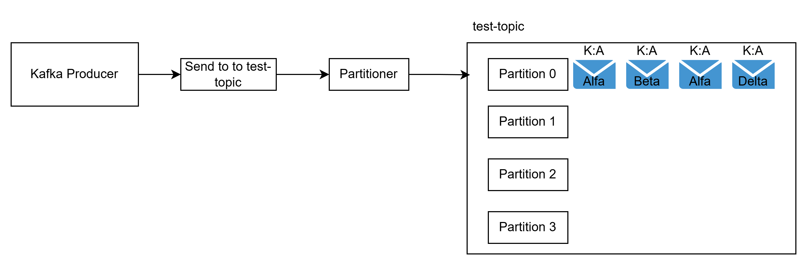
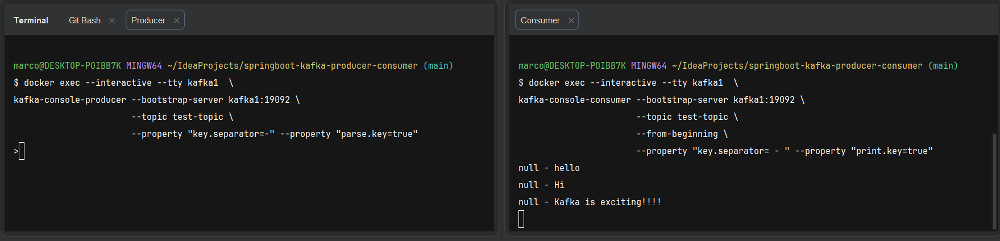
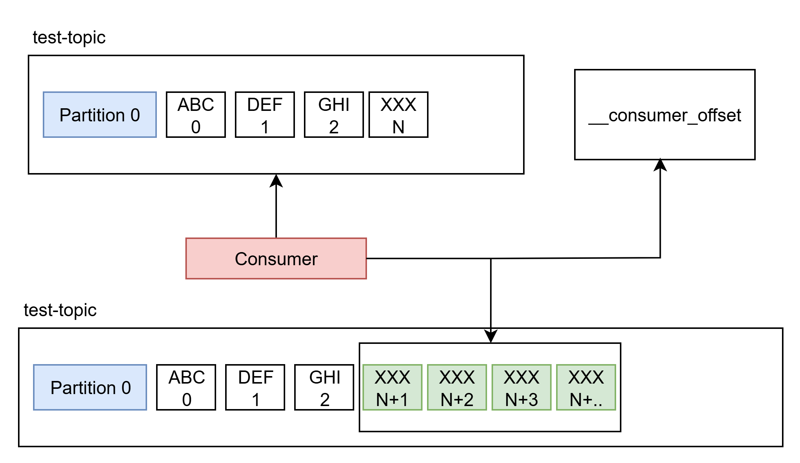
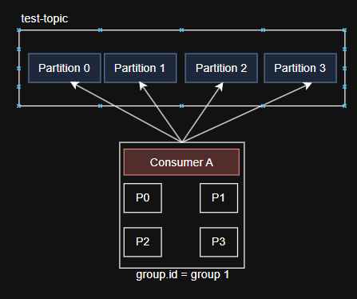
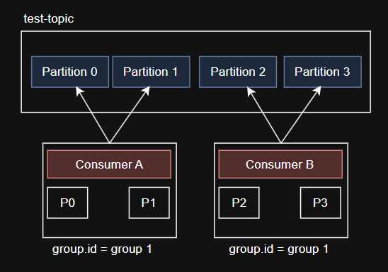
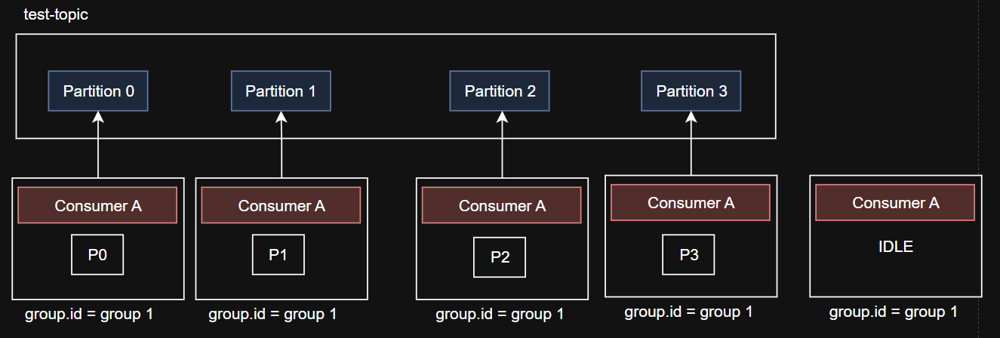
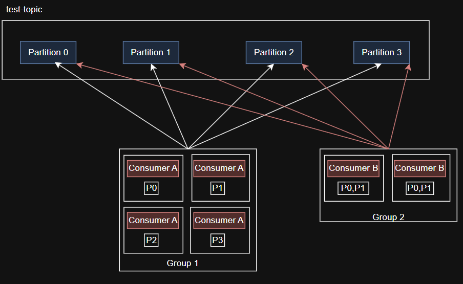

# Kafka with Spring Boot 3 - Producer & Consumer

This us a hands on approach to learn **Apache Kafka ** using **Spring Boot 3**.

## How to run

docker compose up on the root directory

## First Interaction with Kafka Producer and Consumer



In this example, we will use two separate terminals: one for the **producer** and another for the **consumer**.

---

### Prerequisites

Make sure our Kafka container is running:

```bash
docker ps
```

We should see something like:

```bash
CONTAINER ID   IMAGE                             STATUS       PORTS                                  NAMES
9c3dd56c03e4   confluentinc/cp-kafka:7.3.2       Up 22 hours  0.0.0.0:9092->9092/tcp                kafka1
461c96207f8f   confluentinc/cp-zookeeper:7.3.2   Up 22 hours  0.0.0.0:2181->2181/tcp                zoo1
```

---

### Step 1: Access the Kafka container

Run this command in **both terminals**:

```bash
docker exec -it kafka1 bash
```

---

### Step 2: Create a Kafka topic

```bash
kafka-topics --bootstrap-server kafka1:19092 \
--create \
--topic test-topic \
--replication-factor 1 \
--partitions 1
```

> `kafka1:19092` refers to the `KAFKA_ADVERTISED_LISTENERS` configured in your `docker-compose.yml`.

---

### Step 3: Start the Producer

In the first terminal:

```bash
kafka-console-producer \
--bootstrap-server kafka1:19092 \
--topic test-topic
```

---

### Step 4: Start the Consumer

In the second terminal:

```bash
kafka-console-consumer \
--bootstrap-server kafka1:19092 \
--topic test-topic \
--from-beginning
```

---

### Result

Now, type messages in the **producer terminal** and we will see them appear in the **consumer terminal** in real time.

This demonstrates the basic communication flow between a Kafka **producer** and **consumer**.

## Kafka partition ordering

Kafka messages sent by a producer contain two main properties:

- **Key**
- **Value**

When a key is provided, Kafka uses a hashing strategy (via the partitioner) to determine which partition the message
will be sent to.

This guarantees that messages with the same key are always routed to the same partition (as long as the number of
partitions does not change).

#### Example

Given the following messages:

- Alpha
- Beta
- Gamma
- Delta

If all messages use the same key (e.g., `"A"`), Kafka will hash this key and send all of them to the same partition.
Otherwise, if the messages didn't have keys or different keys, all of them would be routed to different partitions

This behavior is important because it preserves **ordering** for messages that share the same key.


## Examples with Key

### Produce Messages with Key and Value

```bash
docker exec --interactive --tty kafka1 \
kafka-console-producer \
--bootstrap-server kafka1:19092 \
--topic test-topic \
--property "key.separator=-" \
--property "parse.key=true"
```

Send messages using the format:

```
key-value
```

#### Example:

```
A-Alpha
A-Beta
A-Gamma
A-Delta
```

---

### Consume Messages with Key and Value

```bash
docker exec --interactive --tty kafka1 \
kafka-console-consumer \
--bootstrap-server kafka1:19092 \
--topic test-topic \
--from-beginning \
--property "key.separator=-" \
--property "print.key=true"
```

---

### Output

The console will display messages including both **key** and **value**:



---

### Error When Sending Message Without Key

If we try to send a message without a key:

```
test with no key
```

We will get the following error:

```text
org.apache.kafka.common.KafkaException: No key separator found on line number 1: 'test with no key'
at kafka.tools.ConsoleProducer$LineMessageReader.parse(ConsoleProducer.scala:374)
at kafka.tools.ConsoleProducer$LineMessageReader.readMessage(ConsoleProducer.scala:349)
at kafka.tools.ConsoleProducer$.main(ConsoleProducer.scala:50)
at kafka.tools.ConsoleProducer.main(ConsoleProducer.scala)
```

Consumer Offsets
aNY MESSAGE THAT IS PRODUCED IN THE TOPIC WILL HAVE A UNIC ID called offset
Consumer have three options to read

* from-beginning
* latest (read only the messages that going come after the consumer is spun up, meaning read the messages in the topic
  by poassing a specif offset from the consumer only done programatically  )
* specific-offset

___

## Offset and `--from-beginning`



* from-beginning
    * Starts from the beginning, so starts from offset 0 and increase one by one, once all records are read, the
      consumer commits the offiset the internal topic? __consumer_offsets com o 'Group ID'. The consumer goes down and
      new records may eventualy be produced on the topic in the meantime, now the consumer knows from where to start
      reading the messages based on the __consumer_offsets
    *

In Apache Kafka, each message inside a partition has a unique and sequential **offset**, which represents its position
in the log.

For example:

```text
Offset | Message
0      | ABC
1      | DEF
2      | GHI
...    | ...
N      | XXX
```

## Kafka Consumer Groups

This section describes the concepts, scalability, and practical implementation of Consumer Groups in Apache Kafka.

## The Problem: Processing Latency (Lag)



Imagine a topic called `test-topic` with **4 partitions**.

If we have only one consumer:

* **Consumer A** (`group.id = group1`)

It will be responsible for pulling data from **all 4 partitions**.

Since message consumption within a single instance is typically **single-threaded**, if the producer sends messages
faster than the consumer can process them, **consumer lag** occurs.

This prevents events from being processed in real time.

---

## The Solution: Consumer Groups

Consumer Groups allow **horizontal and parallel scaling** of message consumption.

---

## How Scalability Works

### 2 Instances

If we spin up a second instance of Consumer A using the same `group.id`, Kafka will split the partitions between them:



* **Instance 1** → Partitions 0 and 1
* **Instance 2** → Partitions 2 and 3

---

### Maximum Capacity

The ideal level of parallelism is reached when:

```text
number of consumers = number of partitions
```

In this case:

```text
4 partitions → 4 consumers
```

---

### Idle Consumers


If there are more consumers than partitions:

* Extra consumers will remain **idle**
* They act as **failover instances**
* They take over if an active consumer fails

---

## Multiple Groups


Different applications can consume the same topic simultaneously.

Each application must have its own **unique `group.id`**.

This ensures:

* Each group maintains its own offsets
* Each group reads messages independently

---

## Group Management

### Responsibility

Kafka brokers are responsible for managing consumer groups.

---

### Group Coordinator

One broker acts as the **Group Coordinator**, responsible for:

* Managing members joining and leaving the group
* Triggering **rebalancing**

---

## Practical Guide with Docker

### 1. List Existing Consumer Groups

If we run a consumer without specifying a group, Kafka creates a random ID:

```text
console-consumer-41911
```

Command:

```bash
docker exec -it kafka1 \
kafka-consumer-groups \
--bootstrap-server kafka1:19092 \
--list
```

---

### 2. Run a Consumer in a Specific Group

To test parallelism, run this command in **two different terminals** using the same group:

```bash
docker exec -it kafka1 \
kafka-console-consumer \
--bootstrap-server kafka1:19092 \
--topic test-topic \
--group console-consumer-41911 \
--property "key.separator= - " \
--property "print.key=true"
```

---

### 3. Alter and Describe Topic Partitions

#### Describe Topic

```bash
docker exec -it kafka1 \
kafka-topics \
--bootstrap-server kafka1:19092 \
--describe \
--topic test-topic
```

#### Increase Partitions

```bash
docker exec -it kafka1 \
kafka-topics \
--bootstrap-server kafka1:19092 \
--alter \
--topic test-topic \
--partitions 2
```

---

### 4. Testing Parallelism (Producer)

When sending messages with keys, Kafka routes them to different partitions.

```bash
docker exec -it kafka1 \
kafka-console-producer \
--bootstrap-server kafka1:19092 \
--topic test-topic \
--property "key.separator=-" \
--property "parse.key=true"
```

---

#### Testing Example

```text
a-abc → Processed by Terminal 1
1-one → Processed by Terminal 2
```

---

### Conclusion

The `group.id` is one of the most critical properties in Kafka.

It defines how the processing load is distributed.

If we have:

```text
40 partitions → up to 40 consumers in parallel
```

This ensures that data is processed as efficiently and quickly as possible.

### How Offset Works

Kafka stores the progress of a consumer using offsets. This information is persisted in an internal topic called:

```text
__consumer_offsets
```

When a consumer reads messages, Kafka keeps track of the **last committed offset** for that consumer group.

This allows us to:

* Resume consumption from where we left off
* Avoid reprocessing messages unnecessarily
* Replay messages when needed

---

## Commit Log & Retention Policy

Kafka stores messages in an **append-only commit log**, organized by partitions. Messages are written sequentially and
persisted on disk.

---

## Retention Policy

The **retention policy** determines how long messages are kept in Kafka before being deleted.

This is configured using:

```properties
log.retention.hours=168
```

* Default value: **168 hours (7 days)**
* After this period, messages become eligible for deletion
* Retention is based on **time**, not whether messages were consumed

---

## Accessing Broker Configuration (Docker)

To inspect the Kafka broker configuration:

```bash
docker exec -it kafka1 bash
```

Navigate to the configuration directory:

```bash
cd /etc/kafka/
ls
```

You should see a file called:

```text
server.properties
```

To view its contents:

```bash
cat server.properties
```

Look for:

```properties
log.retention.hours=168
```

---

## Inspecting Kafka Log Files

Kafka stores data on disk inside the container.

Navigate to the data directory:

```bash
cd /var/lib/kafka/data/
ls
```

You will see directories like:

```text
__consumer_offsets-0
test-topic-0
```

Each directory represents a **partition**.

---

### Example: Inspect a Topic Partition

```bash
cd test-topic-0
ls
```

Output:

```text
00000000000000000000.log
00000000000000000000.index
00000000000000000000.timeindex
leader-epoch-checkpoint
partition.metadata
```

# KafkaTemplate.send() — Behind the Scenes

## Flow Overview
`KafkaTemplate.send()` goes through several internal steps before a message is actually published to a Kafka topic.

---

## 1. Serializer
The client must provide serializers for both key and value:
- `key.serializer`
- `value.serializer`

In this project, we will use the **default serializers**.

---

## 2. Partitioner
This layer determines which partition the message will be sent to within a topic.

- The Kafka Producer API provides a **default partitioner**
- It handles partition selection automatically
- We will use the **default partitioner**

---

## 3. RecordAccumulator
Messages are **not sent immediately** after calling `send()`.

Instead:
- Records are stored in a buffer called the **RecordAccumulator**
- This helps reduce the number of network calls to the Kafka cluster

### Key Concepts:
- Records are grouped into a **RecordBatch**
- Controlled by:
    - `batch.size` → defines the maximum size of the batch (memory limit)

---

## 4. Batch Sending Behavior
- Once the batch is **full**, the messages are sent to the Kafka topic
- However, there are scenarios where the batch may **never fill up**

---

## 5. linger.ms
To handle cases where batches don't fill up:

- `linger.ms` defines how long the producer waits before sending messages
- If:
    - The batch is **not full**, and
    - The time specified by `linger.ms` is reached

👉 Then the accumulated records are sent to Kafka anyway

---

## Summary
- Messages are buffered before being sent
- Kafka optimizes throughput using batching
- `batch.size` controls batch capacity
- `linger.ms` controls max wait time before sending


Configuring  KafkaTemplate
Mandatory Values 
bootstrap-servers: localhost:9092, localhost:9093, localhost:9094  (Represents the broker address)
key-serializer: or.apache.kafka.common.serialization.IntegerSerializer
value-serializer: org.apache.kafka.common.serialization.StringSerializer
---

## Understanding the Files

* `.log` → actual messages stored sequentially
* `.index` → helps Kafka quickly locate messages by offset
* `.timeindex` → maps timestamps to offsets
* `leader-epoch-checkpoint` → tracks leader changes
* `partition.metadata` → partition metadata

---

## How Consumers Read Data

When a consumer connects to Kafka:

* It does **not** read directly from these files
* It requests data from the **broker**
* The broker reads from the commit log and returns messages

If we use `--from-beginning` or a new consumer group:

* Kafka will read from the earliest available offset
* Data is served from these log files internally

---

## Important Behavior

* Messages remain available **until the retention policy expires**
* Consumption does **not delete messages**
* Multiple consumers can read the same data independently

---

## Summary

* Kafka uses an append-only **commit log**
* Data is stored per **partition** on disk
* Retention is time-based (default: 7 days)
* Consumers read through the broker, not directly from disk
* Messages can be replayed as long as they are retained

### Understanding `--from-beginning`

When we start a consumer using:

```bash
kafka-console-consumer \
--bootstrap-server kafka1:19092 \
--topic test-topic \
--from-beginning
```

we are instructing Kafka to:

> Read all messages from the earliest available offset (usually offset 0)

This means:

* We will consume the entire history of the topic
* The consumer will start from the first message ever produced

---

### Important Behavior

If a consumer group already has a committed offset:

* Kafka will resume from the last committed offset
* The `--from-beginning` flag will only take effect if there is **no prior offset stored**

---

### Example Scenario

1. Messages are produced to a partition:

    * ABC (offset 0)
    * DEF (offset 1)
    * GHI (offset 2)

2. A consumer reads up to offset 2 and commits it

3. New messages arrive:

    * XXX (offset N+1, N+2, ...)

4. When the consumer restarts:

    * We will continue from the last committed offset
    * Only new messages will be consumed

---

### Key Takeaways

* Offset represents the position of a message inside a partition
* Offsets are tracked per **consumer group**
* `--from-beginning` allows full replay of messages
* Kafka ensures durability and replayability through offset management

___

## Kafka as a Distributed Streaming System

Kafka is a **distributed streaming platform**.

Before diving deeper, let's recall what a distributed system is:

- A collection of systems working together to deliver value
- High availability and fault tolerance
- Reliable workload distribution
- Easy scalability
- Concurrency handled more efficiently

## Problem: Single Point of Failure

If we have:

- One Kafka broker
- Producers and consumers connected to it

We end up with a **single point of failure**.

If the broker goes down, the entire system becomes unavailable.

## Solution: Kafka Cluster

To solve this, Kafka uses a cluster of multiple brokers.

- Multiple brokers work together
- :contentReference[oaicite:1]{index=1} manages the cluster
- Brokers send heartbeats to ZooKeeper
- ZooKeeper keeps track of which brokers are healthy and active

If a broker fails:

- ZooKeeper detects the failure
- Requests are routed to other brokers
- The system continues to operate without interruption

## How Kafka Handles Data Loss

Kafka prevents data loss through **replication**:

- Topics are replicated across multiple brokers
- Each partition has leader and follower replicas
- If a broker fails, another replica takes over

This ensures durability and high availability.

# Kafka Topic Distribution, Partition Leadership, and Consumer Groups

This note explains how Kafka distributes topics across brokers, how producers choose partitions, how consumers know
where to read from, and how consumer groups split the work.

## 1) How topics are distributed on brokers

A Kafka **cluster** is made of multiple brokers, for example:

* Broker 1
* Broker 2
* Broker 3

A **topic** is not stored as one single block of data. Instead, it is split into **partitions**.

A topic like `test-topic` might look like this:

* `test-topic-0`
* `test-topic-1`
* `test-topic-2`

Each partition belongs to a broker as its **leader** and may also exist on other brokers as **replicas**.

### Important idea

Kafka does not store the whole topic on one broker. It spreads partitions across the cluster so that load and storage
are distributed.

## 2) What is a partition leader?

Every partition has one broker that acts as the **leader**.

The leader is the broker that:

* handles produce requests for that partition
* handles fetch requests from consumers
* coordinates reads and writes for that partition

The other copies of the same partition are called **followers** or **replicas**.

### Example

For one partition:

* Broker 1 = leader
* Broker 2 = follower
* Broker 3 = follower

If Broker 1 fails, one of the replicas can become the new leader.

## 3) Producer flow and the partitioner

A producer does not randomly send data to any broker.

Inside the producer, there is a component called the **partitioner**.

The partitioner decides **which partition** a record should go to.

### How the partitioner chooses a partition

The decision can depend on:

* the message key
* round-robin behavior when no key is provided
* a custom partitioner implementation

### Common rule

If a record has a key, Kafka usually sends records with the same key to the same partition. This is useful when ordering
matters.

If there is no key, Kafka may spread records across partitions to balance traffic.

### Very important detail

The partitioner does **not** choose a broker directly.

It chooses a **partition**, and then the producer sends the record to the **leader broker** of that partition.

## 4) How a producer knows where the leader is

The producer keeps metadata about the cluster.

That metadata tells it:

* which topic exists
* how many partitions the topic has
* which broker is the leader for each partition

So the flow is:

1. Producer asks Kafka for metadata
2. Producer chooses a partition using the partitioner
3. Producer finds the leader broker for that partition
4. Producer sends the record to that broker

If leadership changes because a broker goes down, the producer refreshes metadata and sends requests to the new leader.

## 5) How a consumer knows from where to pull

A consumer also uses cluster metadata.

But before reading data, the consumer usually joins a **consumer group**.

Kafka then assigns partitions to the consumers inside that group.

After assignment, the consumer knows:

* which partitions it owns
* which broker is the leader for each of those partitions
* where to start reading from in each partition

### The read flow

1. Consumer joins a group
2. Kafka assigns partitions to that consumer
3. Consumer requests data from the leader broker of each assigned partition
4. Consumer reads records in offset order

## 6) How Kafka distributes client requests

Kafka distributes client requests mainly through **partitions and leaders**.

### Producer requests

Producer requests go to the leader of the target partition.

That means traffic is spread across brokers as long as partitions are spread across brokers.

### Consumer requests

Consumer requests are fetch requests sent to the leader of the assigned partition.

So the broker that leads a partition is the one that serves reads for that partition.

## 7) Kafka consumer groups

A **consumer group** is a set of consumers working together to read the same topic.

Kafka guarantees that, inside the same group, **one partition is assigned to only one consumer at a time**.

This avoids duplicate work inside the group.

### Example with three consumers

If you have:

* 3 consumer instances
* 3 partitions

Then Kafka can assign:

* Consumer 1 → Partition 0
* Consumer 2 → Partition 1
* Consumer 3 → Partition 2

Each consumer reads only the partition assigned to it.

### Example with more consumers than partitions

If you have:

* 3 consumers
* 2 partitions

Then only 2 consumers will be active for that topic.

One consumer will not receive any partition because a partition cannot be shared inside the same group.

### Example with more partitions than consumers

If you have:

* 2 consumers
* 4 partitions

Then each consumer may receive multiple partitions.

## 8) Does each pull call go to the leader?

Yes.

When a consumer fetches records from a partition, the fetch request goes to the **leader replica** of that partition.

The leader serves the reads, while followers stay in sync by replicating data from the leader.

## 9) A simple full example

Imagine a topic called `test-topic` with 3 partitions:

* `test-topic-0` on Broker 1 as leader
* `test-topic-1` on Broker 2 as leader
* `test-topic-2` on Broker 3 as leader

### Producer side

* Producer receives a record
* Partitioner chooses `test-topic-1`
* Producer sends the record to Broker 2, because Broker 2 is the leader of partition 1

### Consumer side

* Three consumers join the same consumer group
* Kafka assigns one partition to each consumer
* Each consumer fetches from the leader broker of its assigned partition

## 10) Main takeaways

* A topic is split into partitions
* Partitions are spread across brokers
* Each partition has one leader and optional replicas
* The producer partitioner chooses the partition, not the broker directly
* The producer sends data to the leader of that partition
* The consumer learns its partitions through consumer group assignment
* Consumers fetch data from the leader of each assigned partition
* Inside one consumer group, a partition is assigned to only one consumer at a time

## 11) One-sentence summary

Kafka distributes work by splitting topics into partitions, assigning each partition a leader broker, and using producer
partitioning plus consumer group assignment to route writes and reads efficiently across the cluster.

## What is covered

- Kafka fundamentals and internals
- Producer and Consumer APIs using Spring Boot
- REST API to publish events to Kafka
- Kafka Topics, Partitions and Consumer Groups
- Error handling, retry and recovery strategies
- Offset management and scalability

## Testing

- Unit tests using JUnit5 and MockMvc
- Integration tests using Embedded Kafka
- TestContainers for real database testing

## Persistence

- Spring Data JPA
- H2 In-Memory Database

## Tech Stack

- Docker
- Java 17+
- Spring Boot 3
- Apache Kafka
- JUnit 5
- Embedded Kafka
- TestContainers
- Gradle/Maven

WIP